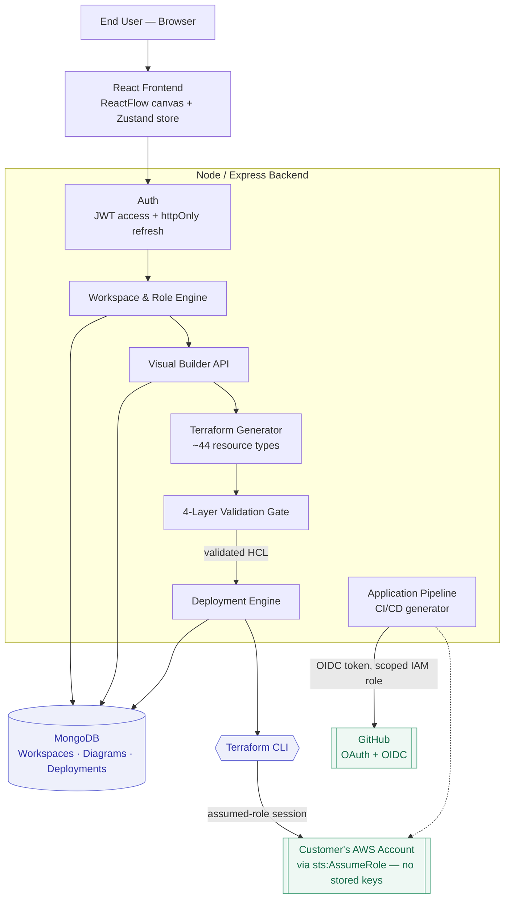

# Infraflow

**Design your AWS infrastructure visually. Deploy it for real — safely, with no stored cloud credentials.**

Infraflow is a visual infrastructure-as-code platform: drag AWS resources onto a canvas, wire them together, and turn that diagram into real, running infrastructure through Terraform — with multiple validation layers standing between your design and your cloud account, and a second, independent pipeline for generating CI/CD for the application code that runs on top of it.

---

## Table of contents

- [What it does](#what-it-does)
- [How it works](#how-it-works)
- [Architecture](#architecture)
- [Security model](#security-model)
- [Tech stack](#tech-stack)
- [Project structure](#project-structure)
- [Getting started](#getting-started)
- [Deployment](#deployment)
- [Roadmap](#roadmap)

---

## What it does

| For | Infraflow gives you |
|---|---|
| **Clients / product owners** | A faster path from "we need infrastructure" to a running system — no hand-written Terraform, no waiting on a specialist for every change, full visibility into what's deployed and what it costs. |
| **Technical managers** | A platform where every deployment goes through structural checks, a real `terraform validate`, and a `terraform plan` before anything touches AWS — plus a live audit trail, drift detection, and workspace-level isolation between teams/customers. |
| **Developers** | A visual builder backed by a real Terraform generator (~44 AWS resource types), an Express/MongoDB backend, and a second pipeline that scaffolds GitHub Actions CI/CD (Docker, ECS/EKS/Lambda/S3+CloudFront) for the application itself. |

## How it works

1. **Sign up** — a private, isolated Workspace is created automatically; you're its owner.
2. **Connect AWS** — paste an IAM Role ARN from your own account (never an access key). Infraflow calls `sts:AssumeRole` for every action; you can revoke access any time by deleting the role.
3. **Connect GitHub** — a standard OAuth consent screen, used later to sync generated files and set up CI/CD.
4. **Design infrastructure** — drag a resource (EC2, S3, Lambda, VPC, RDS, …) onto the canvas, configure it, draw connections to other resources. Connections aren't cosmetic — they resolve into real Terraform references at export time.
5. **Get live feedback** — dangling connections, missing fields, malformed ARNs, and weak security-group rules are flagged as you build.
6. **Deploy** — four layers run before anything reaches AWS: diagram checks re-run server-side, a structural HCL check, a real `terraform validate`, and a `terraform plan` immediately before `apply`.
7. **Watch it deploy** — live status (`queued → deploying → deployed`) with a real-time log stream. A failed first-time deploy is automatically rolled back — nothing is left running and billing silently.
8. **Verify, edit, or destroy** — drift-aware verification against real AWS state, incremental updates on redeploy, and safe teardown (S3 buckets are emptied first, since Terraform can't delete a non-empty bucket).
9. **Ship the application itself** — a separate Application Pipeline module generates a GitHub Actions workflow, Dockerfile, and deploy manifest for ECS, EKS, Lambda, or S3+CloudFront — authenticated via GitHub's own OIDC identity, never a stored AWS key.

## Architecture



Every piece of tenant data (AWS connections, GitHub connection, diagrams, deployments) is scoped to a required `workspace` reference, so isolation between customers is enforced at the data-model level, not just in the UI. Each deployment gets its own Terraform working directory and state, so concurrent deployments across different customers never collide.

## Security model

- **No stored AWS keys, ever.** Customers paste an IAM Role ARN (+ optional External ID); the backend calls `sts:AssumeRole` for every action and uses a short-lived (1-hour) session injected only into that specific request's execution context.
- **GitHub login uses OAuth, not a pasted token.** The resulting access token is encrypted at rest (AES-256-GCM) and excluded from normal database reads.
- **Application CI/CD uses GitHub's own OIDC identity** plus a narrowly-scoped, per-repo IAM role — no AWS keys are ever placed in GitHub Actions secrets for a customer's own deployments.
- **Workspace isolation is structural**, not conventional — every tenant-owned document carries a required workspace reference, and each connected AWS account is accessed only through its own assumed role.

## Tech stack

**Frontend** — React 18, TypeScript, Vite, [ReactFlow](https://reactflow.dev/) (canvas), Zustand (state), Monaco Editor (Terraform preview).

**Backend** — Node.js, Express, MongoDB, the Terraform CLI (via a bundled binary), AWS SDK v3 (STS, IAM, S3, Lambda, RDS, EKS, ECS, CloudWatch, Cost Explorer, and more).

**Infrastructure** — the backend runs as an AWS Lambda function behind API Gateway; the frontend is a static build served from S3 via CloudFront. CI/CD is a GitHub Actions pipeline that builds both, updates the Lambda's configuration, and deploys.

## Project structure

```
.
├── src/                    # React frontend (visual builder, dashboard, settings)
├── IAAS backend/           # Node/Express backend
│   ├── src/
│   │   ├── controllers/    # Route handlers (auth, diagrams, deployments, AWS, GitHub, admin, ...)
│   │   ├── services/       # Terraform generation/execution, AWS role assumption, GitHub OAuth/OIDC
│   │   ├── models/         # Mongoose schemas (Workspace, User, AwsAccount, Diagram, Deployment, ...)
│   │   ├── middleware/     # Auth, validation
│   │   └── config/         # Environment/config loading
│   └── bin/                # Bundled Terraform CLI for the Lambda runtime
├── shared/                 # Resource registry shared between frontend and backend
└── .github/workflows/      # CI/CD pipeline definitions
```

## Getting started

**Prerequisites:** Node.js 20+, a MongoDB instance (local or Atlas), the [Terraform CLI](https://developer.hashicorp.com/terraform/install) if running deployments locally.

```bash
# Frontend
npm install
npm run dev            # http://localhost:5173

# Backend (separate terminal)
cd "IAAS backend"
npm install
cp .env.example .env   # fill in MONGODB_URI at minimum
npm run dev             # http://localhost:4001/api/v1
```

Health check: `GET /api/v1/health`.

To exercise a real deployment locally, set `TERRAFORM_APPLY_ENABLED=true` and connect an AWS account whose role you control — see `IAAS backend/.env.example` for every supported variable and what each one does.

## Deployment

The production build ships via a GitHub Actions workflow (`.github/workflows/infraflow-development-deploy.yml`), triggered manually with an environment selection (development/test/staging/production). One run builds the frontend, deploys it to S3 + invalidates CloudFront, updates the backend Lambda's configuration and code, and bundles the Terraform CLI into the deployment package.

## Roadmap

- **Multi-seat team workspaces.** The role hierarchy (Viewer → Architect → DevOps → Admin → Owner → Super Admin) already exists in the permission-gating code; an invite/team-membership flow to actually assign those roles to more than one person per workspace is next.
- **Self-serve billing.** Usage tiers are enforced today via a manual, admin-approved credit system; a payment integration to remove the human-in-the-loop step is planned.

---

<sub>Generated from a direct review of the current codebase — reflects what's actually implemented, not aspirational planning.</sub>
