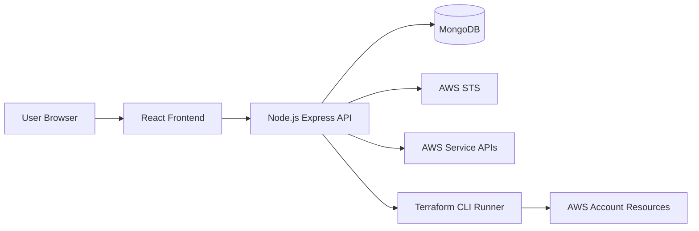
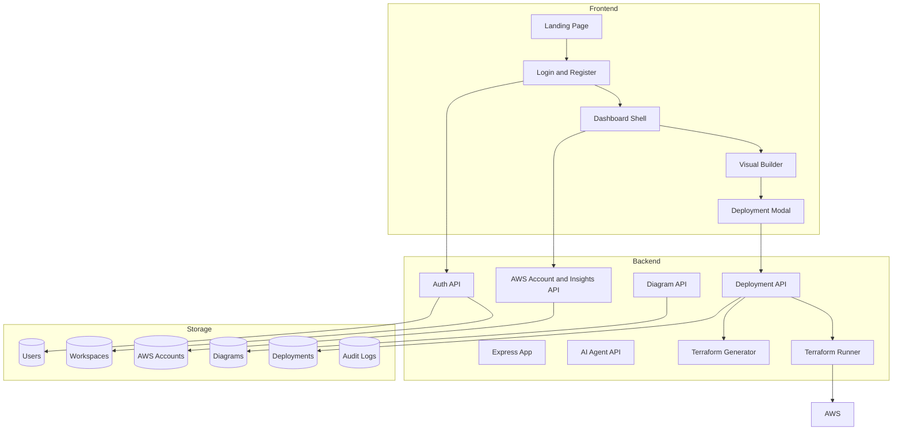
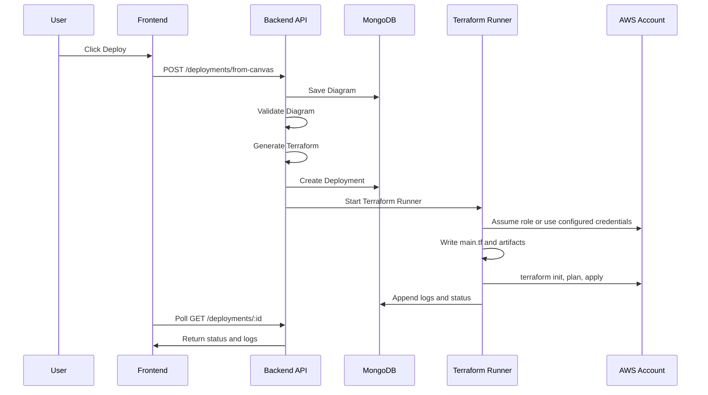
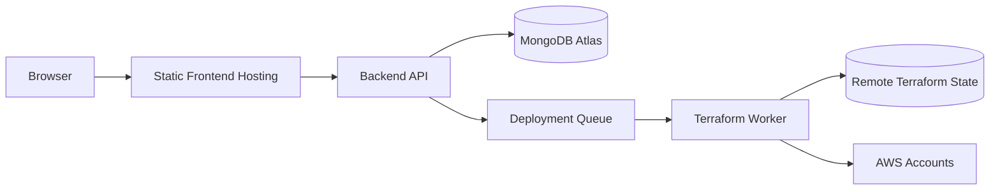

# High Level Design: InfraPilot AI

## 1. Purpose

InfraPilot AI is an AI-powered IaaS and cloud infrastructure automation platform. It allows users to visually design AWS architecture with a node-based builder, connect an AWS account, sync live account insights, generate Terraform, and deploy supported AWS resources to the connected account.

The product has three main surfaces:

- Public landing page for marketing and navigation.
- Authenticated dashboard for AWS insights, visual infrastructure design, Terraform export, and deployment.
- Node.js backend API for authentication, workspace data, AWS sync, Terraform generation, and deployment execution.

## 2. Goals

- Provide a visual AWS infrastructure builder similar to n8n or Make.com.
- Support real user registration and login with role-based access.
- Connect AWS accounts using IAM credentials or assumed role access.
- Sync AWS resource, billing, IAM, CloudWatch, CloudTrail, and inventory data.
- Generate Terraform from diagrams.
- Deploy supported diagram resources to AWS using Terraform.
- Keep dashboard data tied to the user's workspace.

## 3. Non Goals

- Full Terraform Cloud replacement.
- Multi-cloud support.
- Full AWS resource coverage for every service option.
- Production-grade distributed deployment workers.
- Remote Terraform state backend management.
- Automatic rollback or destroy workflow.

## 4. System Context

## 5. Application Architecture

## 6. Frontend Overview

The frontend is a Vite React application.

Major modules:

- `src/landing`: Public SaaS landing page.
- `src/auth`: Login and registration screens plus auth API client.
- `src/dashboard`: Dashboard shell, AWS insights, connect AWS form, and dashboard sections.
- `src/components`: Visual builder canvas, nodes, edges, toolbar, sidebar, properties panel, and deployment modal.
- `src/store`: Zustand diagram state store.
- `src/data/awsServices.ts`: AWS service catalog used by the builder.
- `src/utils`: Terraform export, deployment API client, validation, and plan helpers.

## 7. Backend Overview

The backend is a Node.js Express API with MongoDB via Mongoose.

Major modules:

- `config`: Environment and database configuration.
- `constants`: Roles and supported AWS regions.
- `controllers`: HTTP request handlers.
- `middleware`: Authentication, authorization, validation, and error handling.
- `models`: Mongoose schemas.
- `routes`: API route definitions.
- `services`: AWS sync, role credential handling, and Terraform deployment runner.
- `utils`: Terraform generator, diagram validator, deployment planner, audit logging, token helpers, and AI response helpers.

## 8. Core Capabilities

### 8.1 Authentication and RBAC

Users can register and login. Auth uses JWT access tokens and role-based authorization.

Role hierarchy is defined in `roles.js`. Protected backend routes use:

- `requireAuth` for authenticated access.
- `authorize(role)` for role-based actions.

### 8.2 AWS Account Connection

Users connect an AWS account by providing:

- Account name.
- AWS account ID.
- IAM role ARN or compatible local credential setup.
- External ID when required.
- Default AWS region.

The backend validates account access and syncs data using AWS SDK clients.

### 8.3 AWS Live Sync

AWS live sync collects:

- Account identity.
- Cost Explorer monthly spend and cost by service.
- Lambda functions.
- EC2 instances and EBS volumes.
- S3 buckets.
- RDS instances.
- CloudWatch alarms.
- CloudWatch log groups.
- IAM account summary.
- DynamoDB tables.
- SQS queues.
- SNS topics.
- EventBridge rules.
- API Gateway APIs.
- ECS and EKS clusters.
- CloudTrail recent events.

Permission failures are captured per service so partial sync can still succeed.

### 8.4 Visual Builder

The visual builder uses React Flow. Users can:

- Drag AWS services from the sidebar.
- Connect nodes with edges.
- Edit node properties.
- Add groups and labels.
- Validate the diagram.
- Export JSON, Terraform, PNG, or SVG.
- Delete selected nodes or edges.
- Deploy the diagram to AWS.

### 8.5 Terraform Generation

The backend generates deployment Terraform from diagram nodes. Supported realtime deployment resources currently include:

- API Gateway HTTP API.
- Lambda with generated stub package and execution role.
- DynamoDB table.
- S3 bucket and versioning.
- SQS queue.
- SNS topic.
- EventBridge rule.
- CloudWatch log group.
- IAM role.
- Secrets Manager secret.
- VPC.
- EC2 instance using provided AMI or latest Amazon Linux 2023 lookup.

Unsupported nodes are skipped with comments in generated Terraform.

### 8.6 Deployment Pipeline

Deployment flow:

## 9. Data Storage

MongoDB stores:

- Users.
- Workspaces.
- AWS account connection metadata.
- Diagrams.
- Deployments.
- Agent conversations.
- Audit logs.

Terraform local state is stored in the backend deployment run folder configured by `TERRAFORM_WORK_DIR`.

## 10. Security Design

Security features:

- JWT authentication.
- Role-based authorization.
- Workspace-level data isolation.
- Password hashing with bcrypt.
- Helmet, CORS, rate limiting, and request size limits.
- AWS access through STS role assumption or configured backend credentials.
- External ID support for AWS role assumption.
- No hardcoded AWS keys in source code.

Security considerations:

- `.env` must not be committed.
- Terraform local state can contain sensitive values and must be protected.
- Production deployment should use a managed runner role and remote encrypted state.
- Destructive Terraform operations should require explicit user confirmation before implementation.

## 11. Deployment Architecture

Local development:

- Frontend: Vite dev server.
- Backend: Node.js Express server.
- Database: MongoDB Atlas or local MongoDB.
- Terraform: local portable Terraform binary or system Terraform.

Production recommendation:

## 12. Current Limitations

- Terraform apply currently runs from the backend process, not a separate worker.
- Terraform state is local, not remote S3 plus DynamoDB locking.
- Destroy and rollback workflows are not implemented.
- Advanced AWS resource configuration is limited.
- Some AWS permissions must be added iteratively based on Terraform provider operations.
- AI agent responses are currently utility-driven and not connected to a production LLM workflow.

## 13. Future Enhancements

- Add remote Terraform state per workspace and deployment.
- Add destroy, drift detection, and rollback.
- Add deployment approval workflow.
- Add team workspaces and SSO.
- Add full AWS resource coverage.
- Add a background job queue for Terraform execution.
- Add OpenAI-powered agent actions for cost, security, and architecture remediation.
- Add deployment notifications and audit exports.
