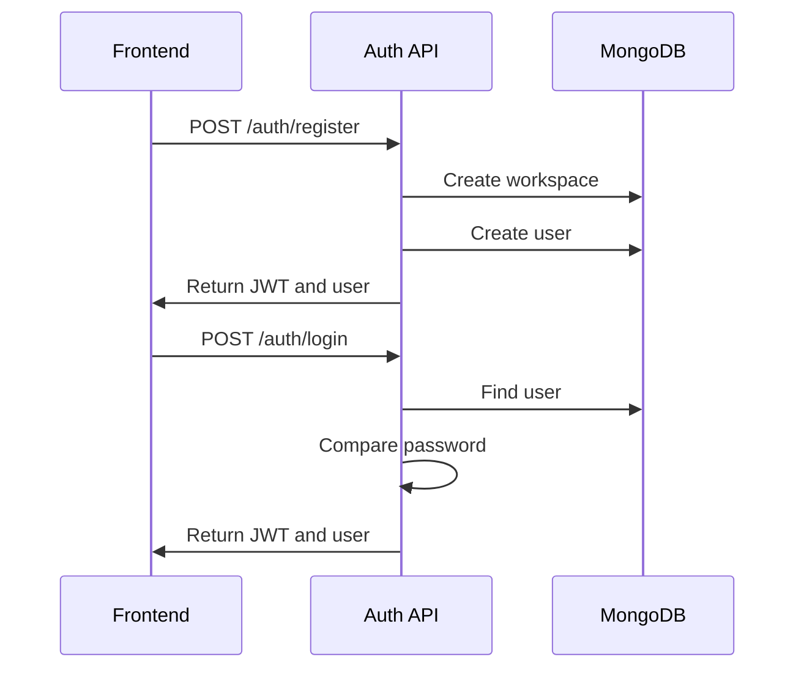
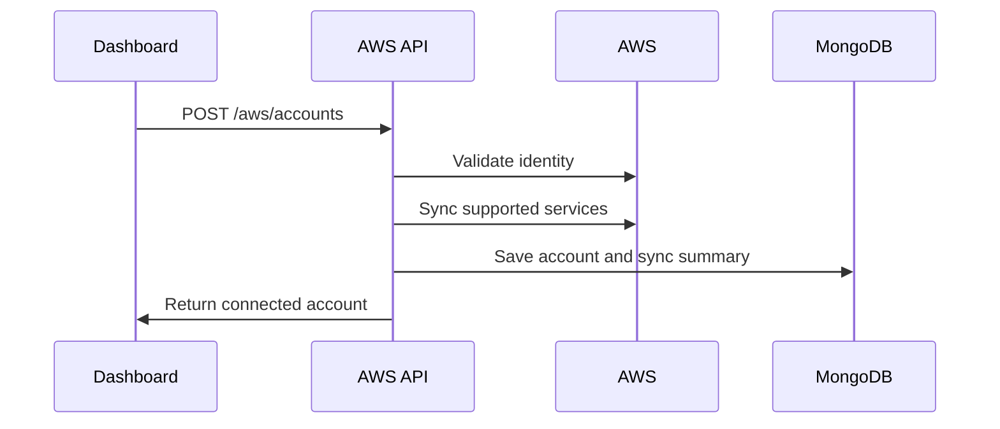
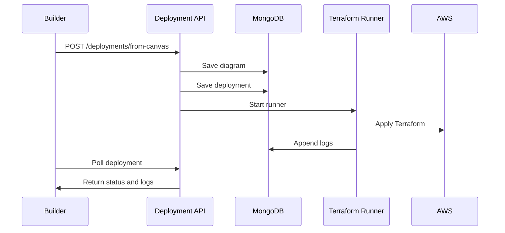

# Low Level Design: InfraPilot AI

## 1. Technology Stack

Frontend:

- React.
- TypeScript.
- Vite.
- React Flow.
- Zustand.
- Lucide React icons.
- Tailwind CSS and custom CSS.

Backend:

- Node.js.
- Express.
- MongoDB with Mongoose.
- Zod validation.
- JWT authentication.
- AWS SDK v3.
- Terraform CLI.

## 2. Source Layout

```text
src/
  auth/
  components/
    edges/
    nodes/
  dashboard/
  data/
  landing/
  store/
  utils/

IAAS backend/src/
  config/
  constants/
  controllers/
  middleware/
  models/
  routes/
  services/
  utils/
```

## 3. Frontend Low Level Design

### 3.1 Routing

Frontend routing is controlled in `src/App.tsx`.

Routes:

- `/`: Landing page.
- `/login`: Authentication page.
- `/dashboard`: Authenticated dashboard.

### 3.2 Authentication Frontend

Files:

- `src/auth/AuthPage.tsx`
- `src/auth/authClient.ts`

Responsibilities:

- Render login and registration forms.
- Submit credentials to backend.
- Store JWT access token and user in local storage.
- Clear session when required.

Important local storage keys:

- `infra-auth-token`
- `infra-auth-user`

### 3.3 Dashboard Shell

File:

- `src/dashboard/DashboardShell.tsx`

Responsibilities:

- Render dashboard layout.
- Manage active dashboard page.
- Load connected AWS accounts.
- Load AWS insights.
- Render Connect AWS form.
- Render AWS inventory, CloudTrail events, security findings, cost cards, deployments, and builder entry points.

Important API client:

- `src/dashboard/awsApi.ts`

AWS API functions:

- `listAwsRegions()`
- `listAwsAccounts()`
- `connectAwsAccount(payload)`
- `syncAwsAccount(id)`
- `getAwsInsights()`

### 3.4 Visual Builder

Files:

- `src/components/Canvas.tsx`
- `src/components/Sidebar.tsx`
- `src/components/Toolbar.tsx`
- `src/components/PropertiesPanel.tsx`
- `src/components/nodes/AwsServiceNode.tsx`
- `src/components/nodes/GroupBoxNode.tsx`
- `src/components/nodes/LabelNode.tsx`
- `src/components/edges/FlowEdge.tsx`
- `src/store/diagramStore.ts`

State store:

- Zustand store in `diagramStore.ts`.

Important store state:

- `nodes`
- `edges`
- `selectedNodeId`
- `selectedEdgeId`
- `mode`
- `activeRegion`
- `issues`
- `history`
- `future`
- `clipboard`

Important store actions:

- `addServiceNode(serviceId, position)`
- `addGroupNode(kind, position)`
- `addLabelNode(position)`
- `onNodesChange(changes)`
- `onEdgesChange(changes)`
- `onConnect(connection)`
- `updateNodeData(nodeId, patch)`
- `updateNodeConfig(nodeId, key, value)`
- `updateEdgeData(edgeId, patch)`
- `deleteSelection()`
- `duplicateSelection()`
- `copySelection()`
- `pasteClipboard()`
- `selectAll()`
- `undo()`
- `redo()`
- `validate()`
- `importDiagram(snapshot)`

### 3.5 AWS Service Catalog

File:

- `src/data/awsServices.ts`

Each AWS service defines:

- ID.
- Display name.
- Category.
- Icon.
- Color.
- Input and output ports.
- Editable fields.
- Terraform resource type.
- Default config.

Example service IDs:

- `ec2`
- `lambda`
- `apigw`
- `s3`
- `dynamodb`
- `sqs`
- `sns`
- `eventbridge`
- `iam`
- `cloudwatch`

### 3.6 Deployment Modal

File:

- `src/components/DeploymentModal.tsx`

Responsibilities:

- Display deployment summary.
- Load connected AWS accounts.
- Let user select deployment target.
- Show deployment checks.
- Show Terraform preview.
- Submit deployment request.
- Poll backend deployment status.
- Display Terraform runner logs.

API helper:

- `src/utils/deploymentApi.ts`

Functions:

- `createCanvasDeployment(payload)`
- `getDeployment(id)`
- `applyDeployment(id)`

### 3.7 Frontend Validation

File:

- `src/utils/validate.ts`

Responsibilities:

- Validate visual diagram before deployment.
- Return node and edge warnings/errors.
- Surface issues in builder UI and deployment modal.

## 4. Backend Low Level Design

### 4.1 Express App

Files:

- `IAAS backend/src/server.js`
- `IAAS backend/src/app.js`

`server.js`:

- Connects MongoDB.
- Starts HTTP server.

`app.js`:

- Sets Express middleware.
- Enables Helmet.
- Enables compression.
- Configures CORS.
- Configures cookie parser.
- Configures JSON body parser.
- Configures rate limiting.
- Mounts `/api/v1` routes.
- Adds not found and error handlers.

### 4.2 Environment Config

File:

- `IAAS backend/src/config/env.js`

Important environment variables:

- `PORT`
- `MONGODB_URI`
- `JWT_ACCESS_SECRET`
- `JWT_REFRESH_SECRET`
- `CLIENT_ORIGIN`
- `AWS_ACCESS_KEY_ID`
- `AWS_SECRET_ACCESS_KEY`
- `AWS_SESSION_TOKEN`
- `AWS_REGION`
- `TERRAFORM_APPLY_ENABLED`
- `TERRAFORM_BIN`
- `TERRAFORM_WORK_DIR`

### 4.3 API Routes

Root router:

- `IAAS backend/src/routes/index.js`

Mounted route groups:

```text
/api/v1/auth
/api/v1/dashboard
/api/v1/diagrams
/api/v1/deployments
/api/v1/aws
/api/v1/agent
/api/v1/users
```

### 4.4 Auth API

Files:

- `routes/authRoutes.js`
- `controllers/authController.js`
- `models/User.js`
- `models/Workspace.js`
- `utils/tokens.js`

Endpoints:

```text
POST /api/v1/auth/register
POST /api/v1/auth/login
POST /api/v1/auth/refresh
POST /api/v1/auth/logout
GET  /api/v1/auth/me
```

Core behavior:

- Register creates workspace and first user.
- Password is hashed with bcrypt.
- Login validates password.
- Access token and refresh token are issued.
- User object is returned to frontend.

### 4.5 Authorization Middleware

Files:

- `middleware/auth.js`
- `middleware/authorize.js`
- `constants/roles.js`

Responsibilities:

- Read bearer token.
- Validate JWT.
- Attach user to request.
- Enforce role hierarchy.

### 4.6 AWS API

Files:

- `routes/awsRoutes.js`
- `controllers/awsController.js`
- `services/awsLiveSync.js`
- `services/awsRoleCredentials.js`
- `models/AwsAccount.js`
- `constants/awsRegions.js`

Endpoints:

```text
GET  /api/v1/aws/regions
GET  /api/v1/aws/accounts
POST /api/v1/aws/accounts
POST /api/v1/aws/accounts/:id/sync
GET  /api/v1/aws/insights
```

AWS account fields:

- `workspace`
- `createdBy`
- `name`
- `accountId`
- `roleArn`
- `externalId`
- `defaultRegion`
- `status`
- `lastSyncAt`
- `lastError`
- `syncSummary`

Sync behavior:

1. Resolve credentials.
2. Call STS identity.
3. Call supported AWS service APIs.
4. Capture permission errors per service.
5. Store normalized summary in `syncSummary`.

### 4.7 Diagram API

Files:

- `routes/diagramRoutes.js`
- `controllers/diagramController.js`
- `models/Diagram.js`
- `utils/diagramValidator.js`

Diagram fields:

- `workspace`
- `createdBy`
- `updatedBy`
- `name`
- `description`
- `activeRegion`
- `nodes`
- `edges`
- `config`
- `tags`
- `lastValidatedAt`
- `validationIssues`

Responsibilities:

- Persist visual diagrams.
- Validate diagrams.
- Keep diagram data scoped by workspace.

### 4.8 Deployment API

Files:

- `routes/deploymentRoutes.js`
- `controllers/deploymentController.js`
- `models/Deployment.js`
- `utils/deploymentPlanner.js`
- `utils/terraformGenerator.js`
- `services/terraformDeploymentRunner.js`

Endpoints:

```text
GET  /api/v1/deployments
GET  /api/v1/deployments/:id
POST /api/v1/deployments/from-canvas
POST /api/v1/deployments/from-diagram/:diagramId
POST /api/v1/deployments/:id/apply
POST /api/v1/deployments/:id/queue
```

Deployment fields:

- `workspace`
- `diagram`
- `requestedBy`
- `awsAccount`
- `name`
- `status`
- `resourceCount`
- `connectionCount`
- `plan`
- `terraform`
- `validationIssues`
- `startedAt`
- `finishedAt`
- `logs`

Deployment statuses:

- `draft`
- `validating`
- `planned`
- `approval_required`
- `queued`
- `deploying`
- `deployed`
- `failed`
- `cancelled`

### 4.9 Deployment Pipeline Detail

#### Step 1: Frontend submit

`DeploymentModal.tsx` calls:

```text
POST /api/v1/deployments/from-canvas
```

Payload:

```json
{
  "name": "Diagram deployment",
  "awsAccountId": "mongo-account-id",
  "activeRegion": "ap-south-1",
  "nodes": [],
  "edges": [],
  "autoApply": true
}
```

#### Step 2: Backend creates diagram

`createDeploymentFromCanvas` creates a `Diagram` document from current canvas nodes and edges.

#### Step 3: Backend creates deployment plan

`buildDeploymentPlan(diagram)`:

- Validates diagram.
- Counts resources and connections.
- Generates Terraform.
- Builds deployment steps.

#### Step 4: Backend creates deployment record

Deployment record stores:

- Generated Terraform.
- Validation issues.
- Plan metadata.
- Initial logs.

#### Step 5: Terraform runner executes

`runTerraformDeployment(deploymentId)`:

1. Loads deployment.
2. Checks `TERRAFORM_APPLY_ENABLED`.
3. Loads AWS account.
4. Resolves AWS credentials.
5. Creates isolated work directory.
6. Writes `main.tf`.
7. Writes `lambda_stub.zip` when Lambda is present.
8. Runs `terraform init`.
9. Runs `terraform plan -out=tfplan`.
10. Runs `terraform apply -auto-approve tfplan`.
11. Updates deployment status and logs.

#### Step 6: Frontend polls logs

`DeploymentModal.tsx` polls:

```text
GET /api/v1/deployments/:id
```

The UI shows current status and latest logs.

### 4.10 Terraform Generator

File:

- `utils/terraformGenerator.js`

Supported deployment node types:

```text
apigw
cloudwatch
dynamodb
ec2
eventbridge
iam
lambda
s3
secrets
sns
sqs
vpc
```

Generated support blocks:

- AWS provider block.
- Latest Amazon Linux 2023 AMI data source for EC2 if AMI is not provided.
- Lambda execution role and policy attachment when Lambda is used.
- Lambda stub zip reference.
- API Gateway to Lambda integrations.
- EventBridge to Lambda targets and permissions.

Unsupported nodes are written as comments and skipped.

### 4.11 AWS Credential Resolution

File:

- `services/awsRoleCredentials.js`

Supported modes:

1. Direct backend environment credentials.
2. Assume connected account role with STS.

Credential logic:

- If no `roleArn` is provided, use backend `.env` AWS credentials.
- If `roleArn` exists, call `sts:AssumeRole`.
- IAM user ARN is rejected because STS assume role requires a role ARN.

### 4.12 Error Handling

Files:

- `utils/ApiError.js`
- `middleware/errorHandler.js`
- `middleware/notFoundHandler.js`
- `utils/asyncHandler.js`

Pattern:

- Controllers throw `ApiError`.
- `asyncHandler` forwards async errors.
- `errorHandler` returns normalized JSON errors.

### 4.13 Audit Logging

Files:

- `models/AuditLog.js`
- `utils/audit.js`

Audit events are created for important actions such as:

- Deployment creation.
- Deployment apply request.
- Deployment queue request.

## 5. Database Design

### 5.1 User

Purpose:

- Stores user identity, credentials, role, workspace membership, and status.

Relationships:

- Belongs to one workspace.

### 5.2 Workspace

Purpose:

- Tenant boundary for users, diagrams, AWS accounts, and deployments.

### 5.3 AwsAccount

Purpose:

- Stores connected AWS account metadata and latest sync summary.

Important index:

- Unique by `workspace` and `accountId`.

### 5.4 Diagram

Purpose:

- Stores visual infrastructure graph.

Important fields:

- `nodes`
- `edges`
- `activeRegion`
- `validationIssues`

### 5.5 Deployment

Purpose:

- Stores Terraform deployment lifecycle.

Important fields:

- `terraform`
- `status`
- `logs`
- `awsAccount`
- `diagram`

### 5.6 AgentConversation

Purpose:

- Stores AI agent conversation context.

### 5.7 AuditLog

Purpose:

- Stores security and operational audit records.

## 6. API Response Convention

Success:

```json
{
  "success": true,
  "data": {}
}
```

Error:

```json
{
  "success": false,
  "message": "Error message"
}
```

## 7. Key Runtime Flows

### 7.1 Register and Login



### 7.2 Connect AWS



### 7.3 Deploy Diagram



## 8. AWS IAM Requirements

Minimum common permissions depend on selected nodes.

For EC2:

```text
ec2:DescribeImages
ec2:DescribeInstanceAttribute
ec2:DescribeInstances
ec2:DescribeInstanceStatus
ec2:DescribeInstanceTypes
ec2:DescribeVpcs
ec2:DescribeSubnets
ec2:DescribeSecurityGroups
ec2:DescribeAvailabilityZones
ec2:DescribeTags
ec2:RunInstances
ec2:CreateTags
ec2:TerminateInstances
ec2:StartInstances
ec2:StopInstances
iam:GetRole
iam:PassRole
iam:CreateInstanceProfile
iam:AddRoleToInstanceProfile
iam:RemoveRoleFromInstanceProfile
iam:DeleteInstanceProfile
```

For Lambda:

```text
lambda:CreateFunction
lambda:GetFunction
lambda:UpdateFunctionCode
lambda:UpdateFunctionConfiguration
lambda:DeleteFunction
lambda:AddPermission
lambda:RemovePermission
iam:CreateRole
iam:GetRole
iam:PassRole
iam:AttachRolePolicy
iam:DetachRolePolicy
iam:DeleteRole
```

For API Gateway:

```text
apigateway:GET
apigateway:POST
apigateway:PUT
apigateway:PATCH
apigateway:DELETE
```

For S3:

```text
s3:CreateBucket
s3:GetBucketLocation
s3:GetBucketVersioning
s3:PutBucketVersioning
s3:DeleteBucket
s3:ListAllMyBuckets
```

For DynamoDB:

```text
dynamodb:CreateTable
dynamodb:DescribeTable
dynamodb:UpdateTable
dynamodb:DeleteTable
dynamodb:ListTables
```

For monitoring and sync:

```text
ce:GetCostAndUsage
cloudtrail:LookupEvents
cloudwatch:DescribeAlarms
logs:DescribeLogGroups
iam:GetAccountSummary
```

## 9. Deployment State and File Layout

Terraform working files are created under:

```text
IAAS backend/.terraform-runs/
```

Each deployment gets a unique subfolder.

Generated files include:

- `main.tf`
- `lambda_stub.zip` when Lambda is used.
- Terraform provider files.
- Terraform state files.

These folders are ignored by backend `.gitignore`.

## 10. Known Risks and Controls

Risk: Terraform apply creates billable resources.

Control:

- `TERRAFORM_APPLY_ENABLED` gate.
- Deployment logs.
- Explicit user deployment action.

Risk: Local Terraform state can contain sensitive data.

Control:

- Ignore local state folders.
- Use remote encrypted state in production.

Risk: Missing AWS permissions cause partial or failed deployment.

Control:

- Show Terraform logs in modal.
- Store failed status and error logs.
- Add permission guidance per resource.

Risk: Backend process runs long Terraform operations.

Control:

- Move Terraform runner to a separate worker in production.

## 11. Production Hardening Checklist

- Move Terraform execution to worker queue.
- Use S3 remote state with DynamoDB locking.
- Encrypt deployment state and secrets.
- Add destroy workflow with approval.
- Add deployment cancellation.
- Add fine-grained policy templates per node.
- Add audit export.
- Add centralized logs.
- Add OpenTelemetry tracing.
- Add CI tests for Terraform generation.
- Add automated IAM permission preflight checks.
